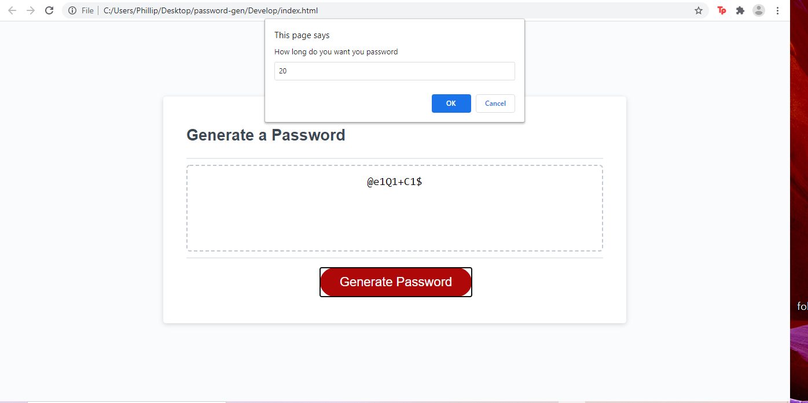
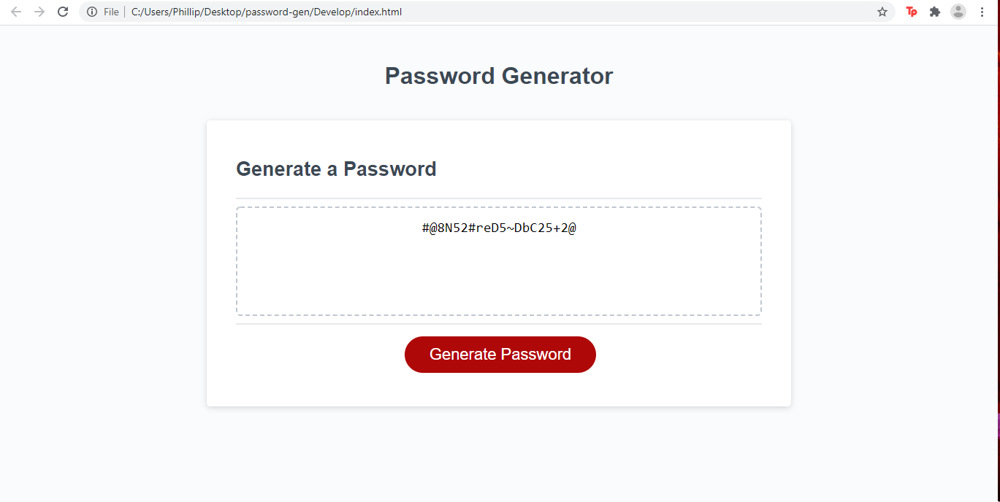

Above is my password generator taken from the home work

i used the if and else statements to make sure conditions
where met before doing more research to find a function that would work.

when you enter number less than 8 ask for higher number
when you enter number greater than 128 ask for lower number

was final able to find the isNaN command allowed be to check for letters or numbers on input
added it to the code so it wont break....

So password generator was it will no take letter or number over 128 and under 8

it will give at least one of every option choosen

finished webpages here 

